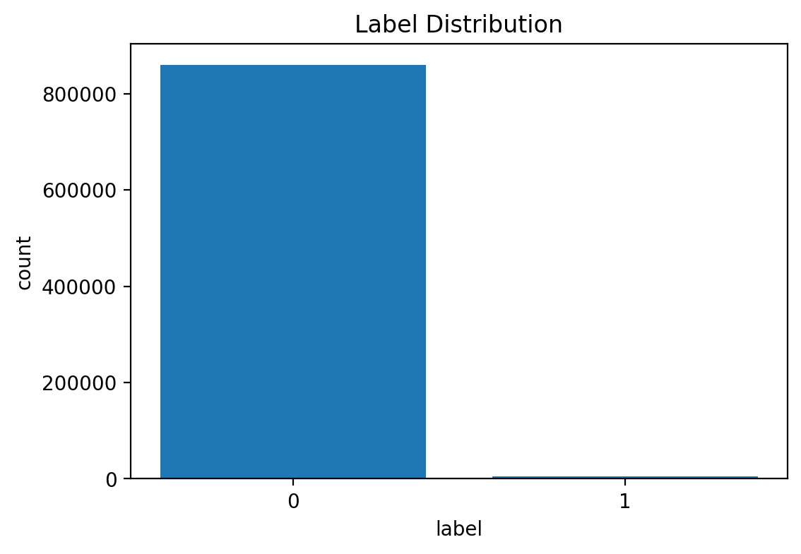

# E-commerce Behavior Projects

## 1. Recommender System
### 1.1 Project Goal
利用電商購物行為建立商品推薦系統，根據使用者過去互動過的商品，推薦可能感興趣的其他商品。

### 1.2 Dataset
- event_time
- event_type
- product_id
- user_id
- brand
- price
- user_session

### 1.3 Method
本專案採用**Item-based Collaborative Filtering**

主要流程如下：
- 將 ‵event_type‵ 轉換為 ‵event_score‵
    - view = 1
    - cart = 2
    - purchase = 3
- 建立 `product_id x user_id` 的互動矩陣
- 使用 `cosine_similarity` 計算商品與商品之間的相似度
- 根據使用者歷史互動商品，累加相似度的商品分數
- 排除使用者已互動過的商品
- 產生 Top-N 推薦結果

### 1.4 Train / Test Split:
使用時間切分方式建立訓練集與測試集:
- train:較早互動的時間資料
- test:較晚互動的時間資料

在評估時，test 保留 `purchase` 作為實際答案，用來檢查推薦結果是否命中使用者真正會購買的商品。

### 1.5 Evaluation
使用以下指標來評估推薦效果:
- Precision@K
- Recall@K
- F1@K

### 1.6 Key Learnings
- Item-based Collaborative Filtering 可以用商品相似度產生推薦結果
- `cosine_similarity` 適合用在稀疏互動矩陣
- K值增加時，通常recall會提高，但precision可能會下降
- 推薦系統評估重點不只是模型建立，也包含推薦的命中機率並驗證

================================================================================

## 2. Purchase Prediction Project
### 2.1 Project Goal
使用電商行為資料，建立 Purchase Prediction Model，預測使用者未來是否會購買某商品。

### 2.2 Dataset
- event_time
- event_type
- product_id
- user_id
- price

### 2.3 Problem Setting
- past data: 建立特徵
- future data: 建立label
- label = 未來是否 purchase

### 2.4 Class Imbalance / Label Distribution

此資料集具有明顯的類別不平衡問題，label = 0（未購買）遠多於 label = 1（已購買）。

### 2.5 Baseline Model
使用 Logistic Regression 建立 baseline model。

### 2.6 Evaluation
| Metric | Score |
|---|---:|
| Precision | 0.06 |
| Recall | 0.22 |
| F1-score | 0.09 |

### Threshold Comparison

| Threshold | Precision | Recall | F1-score |
|---|---:|---:|---:|
| 0.3 | 0.005 | 1.000 | 0.010 |
| 0.5 | 0.026 | 0.584 | 0.049 |
| 0.7 | 0.038 | 0.363 | 0.069 |
| 0.9 | 0.056 | 0.217 | 0.089 |

### Before vs After Standardization

| Setting | Precision | Recall | F1-score |
|---|---:|---:|---:|
| Without StandardScaler | 0.056 | 0.217 | 0.089 |
| With StandardScaler | 0.060 | 0.220 | 0.090 |

### Confusion Matrix at Threshold = 0.9

| Actual \ Predicted | 0 | 1 |
|---|---:|---:|
| 0 | 168855 | 3172 |
| 1 | 680 | 188 |

### 2.7 Key Learnings
- 需要時間切分避免資料洩漏
- 類別不平衡會影響模型表現
- threshold 會影響 precision / recall
- 標準化對 Logistic Regression 有幫助

### 2.8 Conclusion
本專案使用時間切分方式建立 Purchase Prediction 流程，並以 Logistic Regression 作為 baseline model。結果顯示，在高度不平衡下，使用threshold 調整與標準化都能夠幫助模型表現更好，後續可以透過新增特徵與優化抽樣方式，進一步改善預測能力。
